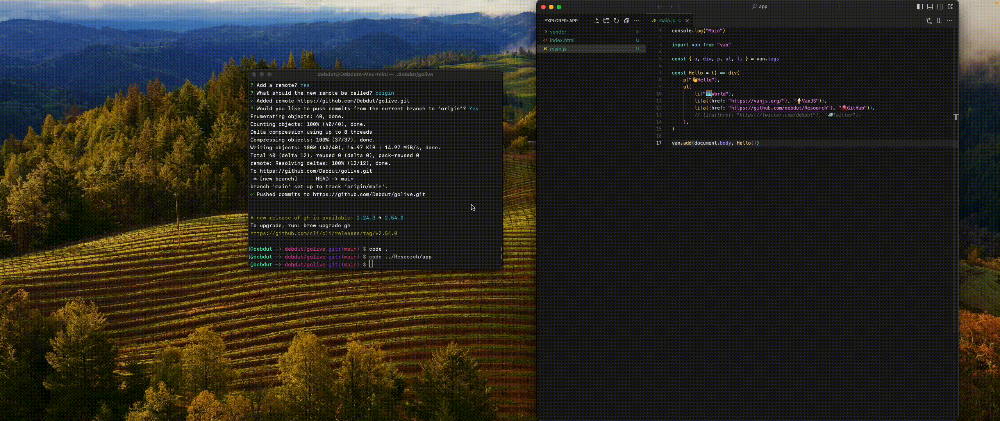

# golive

golive is a lightweight and improved `live-server` alternative written in Go. It allows you to serve a directory and its subpaths over HTTP or HTTPS with ease. Can be used for local web development, production static-site serving, or as a network file host.

---



## Installation

1. Make sure you have Go installed on your system.
2. Make sure you've the `$GOPATH/bin` directory added to your system's PATH.
2. Run the following command to install golive:

   ```
   go install github.com/debdut/golive
   ```

Alternatively, you can download the binary from [releases](https://github.com/Debdut/golive/releases) and use it.

## Usage

To serve the current directory on the default port (80):

```
golive
```

To serve a specific directory on a custom port:

```
golive -d /path/to/directory -p 8080
```

To enable browser caching:

```
golive -c
```

To start in server mode on port 80 and suppress browser opening:

```
golive -s
```

To serve over HTTPS with a custom port and SSL certificate:

```
golive -https-port 8443 -cert /path/to/cert.pem -key /path/to/key.pem
```

For more options and information, run:

```
golive -h
```

## Command-line Options

golive supports the following command-line options:

- `-q`, `--quiet`: Stops golive from opening the browser when started.
- `-c`, `--cache`: Allows browser caching of pages. Can lead to stale results, off by default.
- `-p`, `--port`: Sets the port to serve on (default: 80).
- `-v`, `--version`: Prints the version of golive.
- `-d`, `--dir`: Selects the directory you want to serve. Serves all subpaths that the user has read permissions for (default: ./).
- `-s`, `--serve`: Starts in server mode on port 80 and in quiet mode.
- `--https-port`: Sets the HTTPS port to serve on.
- `--cert`: Specifies the path to the SSL certificate file.
- `--key`: Specifies the path to the SSL key file.
- `-H`, `--headers`: Comma-separated list of custom headers to add (e.g., 'X-Custom-Header:value,Another-Header:another_value').

For more information and examples, run:

```
golive -h
```

## Credits

golive was inspired by and built upon the boilerplate code from [go-live](https://github.com/antsankov/go-live) by Anton Sankov. The original project provided a nice basic HTTP server, but I needed additional features like live reload and HTTPS support. Implementing these features required significant modifications and 4x expansion of the original codebase. I forked because I wanted to take it in a new direction that fit's my purpose.
